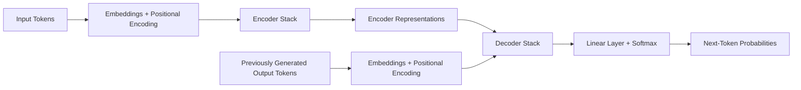

# Attention Is All You Need — Research Notes

## Paper Information

- **Title:** Attention Is All You Need
- **Authors:** Ashish Vaswani, Noam Shazeer, Niki Parmar, Jakob Uszkoreit, Llion Jones, Aidan N. Gomez, Łukasz Kaiser, and Illia Polosukhin
- **Conference:** 31st Conference on Neural Information Processing Systems (NIPS), 2017
- **Primary paper:** https://arxiv.org/abs/1706.03762
- **Google Research page:** https://research.google/pubs/attention-is-all-you-need/

## Executive Summary

This paper introduced the **Transformer**, a neural-network architecture that replaced recurrence and convolution with attention mechanisms for sequence-to-sequence tasks.

Before the Transformer, many language systems processed tokens sequentially using recurrent neural networks such as RNNs and LSTMs. That sequential dependency limited parallel computation and made long-range relationships harder to learn. The Transformer instead lets each token compare itself with other tokens through **self-attention**.

The original paper focused mainly on machine translation, not chatbots or guardrails. However, its architecture became the foundation for many later language models and model-based safety systems.

The central idea is:

```text
Represent every token as a vector.
Let each token score the relevance of other tokens.
Use those relevance scores to combine information.
Repeat this process across multiple attention heads and layers.
```

---

## 1. The Problem the Paper Addressed

Earlier sequence models commonly used an encoder-decoder structure built from recurrent or convolutional networks.

### Recurrent models

A recurrent model processes a sequence in order:

```text
token 1 → token 2 → token 3 → token 4
```

The hidden state at one position depends on the state from the previous position. This creates two major problems:

1. **Limited parallelization:** later positions must wait for earlier positions.
2. **Long dependency paths:** information may have to pass through many sequential steps.

For long sequences, that can make training slower and make distant relationships more difficult to learn.

### Transformer approach

The Transformer removes recurrence from the core architecture. Self-attention allows every position to directly consider every other permitted position in the sequence.

```text
token 1 ↔ token 2 ↔ token 3 ↔ token 4
```

This provides shorter paths between distant tokens and allows much more computation to happen in parallel during training.

---

## 2. High-Level Transformer Architecture

The original Transformer is an **encoder-decoder** model.



### Encoder

The encoder converts the input sequence into contextual representations.

The original paper used:

- 6 encoder layers
- model dimension `d_model = 512`
- 8 attention heads
- feed-forward hidden dimension `d_ff = 2048`

Each encoder layer contains:

1. Multi-head self-attention
2. Residual connection and layer normalization
3. Position-wise feed-forward network
4. Another residual connection and layer normalization

### Decoder

The decoder generates the output one token at a time.

Each decoder layer contains:

1. Masked multi-head self-attention
2. Encoder-decoder attention
3. Position-wise feed-forward network
4. Residual connections and layer normalization around the sublayers

The decoder mask prevents a position from seeing future output tokens during training.

---

## 3. Attention in Plain Language

Attention answers a question similar to:

> For the token currently being processed, which other tokens contain the most useful information?

Each token is projected into three vectors:

- **Query (Q):** what this token is looking for
- **Key (K):** what each token can be matched against
- **Value (V):** the information each token can contribute

A useful analogy is a search system:

```text
Query = search request
Keys = searchable labels
Values = information returned from matching labels
```

The model compares a query with all keys. Stronger matches receive larger weights. Those weights are then used to combine the values.

---

## 4. Scaled Dot-Product Attention

The paper defines attention as:

\[
\text{Attention}(Q,K,V)
=
\text{softmax}\left(
\frac{QK^T}{\sqrt{d_k}}
\right)V
\]

### Step-by-step

1. **Compare queries and keys**

\[
QK^T
\]

This produces similarity scores.

2. **Scale the scores**

\[
\frac{QK^T}{\sqrt{d_k}}
\]

Without scaling, large key dimensions can produce large dot products. That can push softmax into regions with extremely small gradients.

3. **Normalize with softmax**

Softmax converts the scores into attention weights.

4. **Combine the values**

The attention weights determine how strongly each value contributes to the output.

### Simplified example

Suppose the sentence is:

```text
The animal did not cross the road because it was tired.
```

When processing `it`, attention can assign stronger weight to `animal` than to `road`, helping the model form a context-dependent representation.

---

## 5. Multi-Head Attention

A single attention operation may focus on only one pattern. Multi-head attention runs several attention operations in parallel using different learned projections.

\[
\text{MultiHead}(Q,K,V)
=
\text{Concat}(\text{head}_1,\ldots,\text{head}_h)W^O
\]

Each head is:

\[
\text{head}_i
=
\text{Attention}(QW_i^Q,KW_i^K,VW_i^V)
\]

The original model used 8 heads. Each head used key and value dimensions of 64.

Different heads can learn different relationships, such as:

- nearby phrase structure
- subject-object relationships
- agreement between distant words
- positional patterns
- semantic relationships

The outputs of all heads are concatenated and projected back into the model dimension.

### Important caution

Multiple heads provide multiple learned representation spaces, but an attention map should not automatically be treated as a complete explanation of a model’s decision.

---

## 6. Three Uses of Attention in the Original Model

### 6.1 Encoder self-attention

Queries, keys, and values all come from the encoder’s previous layer.

Each input position can attend to all input positions.

```text
input token ↔ every input token
```

### 6.2 Masked decoder self-attention

Queries, keys, and values come from the decoder.

The mask prevents each position from attending to future tokens.

```text
position 4 may see positions 1–4
position 4 may not see positions 5+
```

This preserves autoregressive generation.

### 6.3 Encoder-decoder attention

Queries come from the decoder, while keys and values come from the encoder output.

This lets the decoder use relevant information from the input while generating each output token.

---

## 7. Positional Encoding

Self-attention alone does not inherently know token order. A sequence with the same tokens in a different order would otherwise contain the same set of token embeddings.

The paper adds positional encodings to token embeddings.

\[
PE_{(pos,2i)}
=
\sin\left(
\frac{pos}{10000^{2i/d_{\text{model}}}}
\right)
\]

\[
PE_{(pos,2i+1)}
=
\cos\left(
\frac{pos}{10000^{2i/d_{\text{model}}}}
\right)
\]

These sinusoidal patterns provide information about absolute and relative positions.

The paper also tested learned positional embeddings and reported similar performance. It selected sinusoidal encoding partly because it might extrapolate to sequence lengths beyond those seen during training.

---

## 8. Position-Wise Feed-Forward Network

Attention mixes information between positions. After attention, every position independently passes through the same feed-forward network within that layer.

\[
FFN(x)
=
\max(0,xW_1+b_1)W_2+b_2
\]

The original model used:

```text
input/output dimension: 512
inner dimension: 2048
activation: ReLU
```

The feed-forward network transforms the representation at each position after contextual information has been gathered through attention.

---

## 9. Residual Connections and Layer Normalization

Each major sublayer is wrapped with a residual connection followed by layer normalization:

\[
\text{LayerNorm}(x+\text{Sublayer}(x))
\]

### Residual connection

The sublayer output is added back to its input. This helps information and gradients pass through deep networks.

### Layer normalization

Layer normalization stabilizes activations and helps training.

The ordering used in the original paper is commonly called **post-norm**, because normalization occurs after adding the residual.

---

## 10. Embeddings, Weight Sharing, and Output Probabilities

Input and output tokens are converted into vectors using learned embeddings.

The decoder’s final representation is passed through:

```text
decoder output
→ linear projection
→ softmax
→ probability distribution over the vocabulary
```

The paper shared weights between:

- input embedding matrix
- output embedding matrix
- pre-softmax linear transformation

Weight sharing reduces the number of separate parameters and ties related representations together.

---

## 11. Why Self-Attention Was Attractive

The paper compared self-attention with recurrent and convolutional layers using:

1. Per-layer computational complexity
2. Number of sequential operations
3. Maximum path length between positions

For sequence length `n` and representation dimension `d`, the original full self-attention layer has approximate complexity:

\[
O(n^2d)
\]

Its number of sequential operations is:

\[
O(1)
\]

A recurrent layer has sequential operations proportional to:

\[
O(n)
\]

### Main advantage

All positions can be processed together during training, and any two positions are connected through a short path.

### Main cost

Full attention compares every token with every other token. Its computation and attention-memory requirements grow quadratically with sequence length.

That limitation becomes especially important for long prompts, long documents, and long-context guardrail evaluation.

---

## 12. Training Setup in the Paper

The paper trained on machine-translation datasets.

### English-to-German

- WMT 2014 English-German
- Approximately 4.5 million sentence pairs
- Shared byte-pair-encoding vocabulary of about 37,000 tokens

### English-to-French

- WMT 2014 English-French
- Approximately 36 million sentence pairs
- Word-piece vocabulary of about 32,000 tokens

### Hardware

The models were trained on one machine with 8 NVIDIA P100 GPUs.

The paper reported:

- Base model: about 100,000 steps, approximately 12 hours
- Big model: about 300,000 steps, approximately 3.5 days

### Optimization

The model used Adam with:

```text
β1 = 0.9
β2 = 0.98
ε = 10^-9
warmup steps = 4000
```

The learning rate first increased during warmup and then decreased proportionally to the inverse square root of the step number.

### Regularization

The paper used:

- residual dropout
- attention dropout
- label smoothing

Label smoothing slightly worsened perplexity but improved accuracy and BLEU score.

---

## 13. Main Experimental Results

The large Transformer achieved the following results in the paper’s main table:

| Task | BLEU score |
|---|---:|
| WMT 2014 English-to-German | 28.4 |
| WMT 2014 English-to-French | 41.8 |

At the time, these results exceeded previously reported comparison systems while requiring substantially less training computation than several competing approaches.

The paper also tested English constituency parsing. This supported the claim that the Transformer could generalize beyond only the exact translation setup.

---

## 14. What the Paper Actually Proved

The paper provided evidence that:

- recurrence was not required for strong sequence transduction
- attention-only architectures could achieve state-of-the-art translation results
- removing recurrent dependencies improved training parallelization
- short paths between positions helped model distant relationships
- multi-head self-attention could learn useful syntactic and semantic patterns
- the architecture could transfer to another structured language task

It did **not** directly prove that:

- attention eliminates hallucinations
- transformers are automatically safe
- attention weights fully explain decisions
- larger models are always better
- every later language-model architecture must use the exact encoder-decoder design
- model-based guardrails are reliable without evaluation

Architecture provides capability. Safety depends on training data, objectives, policies, thresholds, system design, and evaluation.

---

## 15. Relevance to the XSignOn Guardrail Project

This paper is foundational rather than guardrail-specific.

### 15.1 Why model-based guardrails understand context better than keywords

A keyword rule checks explicit strings:

```text
if "ignore previous instructions" appears:
    block
```

A transformer-based classifier can construct contextual token representations using self-attention. This gives it a chance to identify semantic patterns that are not exact keyword matches.

However, the architecture alone does not guarantee correct classification. The model must still be trained on relevant safety categories and evaluated on realistic attacks.

### 15.2 Input and output classification

Our Layer 3 pipeline can be represented as:

```text
User Prompt
→ Transformer-Based Input Guardrail
→ Main Language Model
→ Transformer-Based Output Guardrail
→ Final Decision
```

The guardrail model and the main language model may both use transformer components, but they have different objectives:

```text
Main LLM:
generate useful text

Guardrail model:
classify or score safety risk
```

### 15.3 Why larger guardrail models can capture broader risks

A small specialized classifier may be trained for one narrow category such as HAP toxicity.

A larger instruction-aware safety model can potentially reason across:

- prompt injection
- jailbreaks
- harmful requests
- unsafe generated responses
- context-dependent policy violations
- multi-turn conversations

This broader capability comes from model scale, training data, objectives, context length, and safety taxonomy—not merely from having attention.

### 15.4 Long-context cost

The original attention mechanism has quadratic scaling with sequence length.

For guardrails, this matters when analyzing:

- long user prompts
- retrieved RAG documents
- conversation history
- tool outputs
- large generated responses

A production system may need truncation, chunking, hierarchical checks, efficient-attention variants, or separate specialized classifiers.

### 15.5 Observability implications

A transformer guardrail should log operational evidence such as:

```text
model name and version
input/output stage
risk label
confidence or score
threshold
decision
latency
token count
policy category
request ID
```

Attention internals alone are not sufficient audit evidence. The system still needs explicit decision records, test cases, metrics, and failure analysis.

---

## 16. Connection to Our Existing Prototypes

### Rule-based prototype

```text
Strength:
fast, simple, deterministic, easy to audit

Weakness:
limited to known patterns and wording
```

### Granite Guardian HAP 38M prototype

```text
Strength:
model-based contextual HAP classification

Weakness:
narrow safety scope
```

### Larger future guardrail model

```text
Potential strength:
broader contextual risk coverage

Potential cost:
more VRAM, latency, compute, and deployment complexity
```

The Transformer paper explains the architecture underneath many such models, but it does not determine which model is best for our use case. That requires testing.

---

## 17. Evaluation Questions for Future Guardrail Models

When testing a larger model on the Windows RTX system, evaluate:

1. Does it detect paraphrased attacks rather than only exact phrases?
2. Which risk categories does its model card explicitly support?
3. Does it classify both prompts and responses?
4. How does accuracy change after quantization?
5. What is the false-positive rate on benign prompts?
6. What is the false-negative rate on adversarial prompts?
7. How much VRAM does it use?
8. What is its latency per request?
9. Does performance degrade on long contexts?
10. Can every allow/block decision be logged in a structured format?

The correct comparison is not simply:

```text
larger model versus smaller model
```

It is:

```text
coverage + accuracy + latency + memory + auditability + deployment reliability
```

---

## 18. Key Takeaways

- The Transformer replaced recurrence with attention as the core sequence-processing mechanism.
- Self-attention lets every token directly incorporate information from other tokens.
- Queries, keys, and values determine how information is selected and combined.
- Multi-head attention learns multiple representation patterns in parallel.
- Positional encoding adds sequence-order information.
- Masking prevents a decoder from using future output tokens.
- Feed-forward layers transform each contextualized token representation.
- Residual connections and normalization stabilize deep training.
- Training is highly parallelizable compared with recurrent architectures.
- Original full attention has quadratic cost in sequence length.
- The paper introduced an architecture, not a complete safety solution.
- Guardrail quality still depends on safety training, risk coverage, thresholds, observability, and evaluation.

---

## Citation

```bibtex
@inproceedings{vaswani2017attention,
  title={Attention Is All You Need},
  author={Vaswani, Ashish and Shazeer, Noam and Parmar, Niki and
          Uszkoreit, Jakob and Jones, Llion and Gomez, Aidan N. and
          Kaiser, Lukasz and Polosukhin, Illia},
  booktitle={Advances in Neural Information Processing Systems},
  volume={30},
  year={2017}
}
```

## References

1. Vaswani et al., **Attention Is All You Need**  
   https://arxiv.org/abs/1706.03762

2. Google Research publication page  
   https://research.google/pubs/attention-is-all-you-need/

3. NeurIPS paper record  
   https://proceedings.neurips.cc/paper/7181-attention-is-all-you-need
